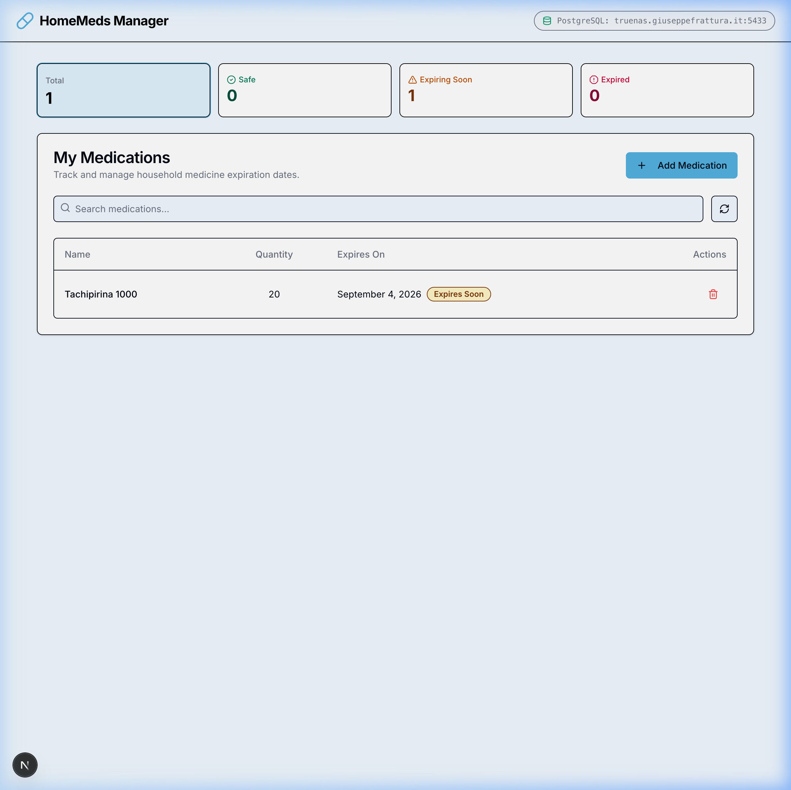

# HomeMeds Manager 💊

A modern, full-stack web application designed to help households track, manage, and monitor the expiration dates of their home medications and first-aid supplies.

Data is persisted directly in a **PostgreSQL** database backend with Next.js Server Actions.



---

## ✨ Features

- **Expiration Date Monitoring:** Automatically categorizes medications into three clear statuses:
  - 🟢 **Safe:** Well before expiration date (> 30 days).
  - 🟡 **Expires Soon:** Expiring within the next 30 days.
  - 🔴 **Expired:** Past the expiration date.
- **Interactive Quick Filters & Dashboard:** Clickable summary cards (*Total*, *Safe*, *Expiring Soon*, *Expired*) that instantly filter the medication list.
- **Search & Sort:** Live search by medication name with automatic chronological sorting by expiration date.
- **Inventory Management:**
  - Add medications with name, quantity, and expiration date using an intuitive date picker.
  - Allows cataloging already expired medicines to facilitate home cabinet cleanup.
  - Safe deletion with confirmation dialogs.
- **PostgreSQL Database Backend:**
  - Centralized persistence on PostgreSQL server (`truenas.giuseppefrattura.it:5433`, `homemeds` database, `medications` table).
  - Automatic table initialization on startup (`CREATE TABLE IF NOT EXISTS`).
  - Next.js 16 Server Actions for safe, pooled, and type-safe CRUD operations.
- **Responsive & Accessible UI:** Clean, modern interface styled with Tailwind CSS and Radix UI primitives.

---

## 🛠️ Technology Stack

| Layer | Technology |
| :--- | :--- |
| **Framework** | [Next.js 16](https://nextjs.org/) (App Router, Turbopack, Server Actions) |
| **Database** | [PostgreSQL 17](https://www.postgresql.org/) (`pg` connection pool) |
| **Language** | [TypeScript](https://www.typescriptlang.org/) |
| **UI & Styling** | [Tailwind CSS v4](https://tailwindcss.com/), [Radix UI](https://www.radix-ui.com/), [Lucide React](https://lucide.dev/) |
| **Forms & Validation** | [React Hook Form](https://react-hook-form.com/), [Zod](https://zod.dev/) |
| **Date Handling** | [date-fns](https://date-fns.org/), [react-day-picker](https://react-day-picker.js.org/) |
| **Containerization** | [Docker](https://www.docker.com/) & Docker Compose (Standalone Next.js output) |

---

## ⚙️ Environment Variables

Configure the following variables in `.env.local`:

```env
# PostgreSQL Configuration
POSTGRES_HOST=truenas.giuseppefrattura.it
POSTGRES_PORT=5433
POSTGRES_DATABASE=homemeds
POSTGRES_USER=homemeds_user
POSTGRES_PASSWORD=homemeds_password

# App URL
NEXT_PUBLIC_APP_URL=http://localhost:3040
```

---

## 🚀 Getting Started

### Prerequisites

- **Node.js**: `v20+` or `v22+`
- **npm**: `v10+`
- **PostgreSQL Server**: Running at `truenas.giuseppefrattura.it:5433` with database `homemeds` and user `homemeds_user`

### Installation

1. Clone the repository and navigate into the project directory:
   ```bash
   git clone <repository-url>
   cd HomeMeds
   ```

2. Install dependencies:
   ```bash
   npm install
   ```

3. Configure your `.env.local` file with the database credentials.

### Running Locally

Start the development server with Turbopack:

```bash
npm run dev
```

Open [http://localhost:9002](http://localhost:9002) in your browser. The app will automatically connect to PostgreSQL and ensure the `medications` table exists.

---

## 📜 Available Scripts

- `npm run dev`: Starts the Next.js development server with Turbopack on port `9002`.
- `npm run build`: Compiles and builds the production application with standalone output.
- `npm run start`: Starts the Next.js production server.
- `npm run typecheck`: Runs strict TypeScript type checking (`tsc --noEmit`).
- `npm run lint`: Runs ESLint / Next.js linter.

---

## 🐳 Docker Deployment

To build and run the standalone container with Docker Compose:

```bash
docker compose up -d --build
```

The application will be accessible at [http://localhost:3040](http://localhost:3040) with built-in health checks at `/_health`.

---

## 📁 Project Structure

```text
├── docs/
│   └── screenshot.png       # Screenshot dell'applicazione
├── src/
│   ├── app/
│   │   ├── _health/         # Health check endpoint
│   │   ├── globals.css      # Design tokens and Tailwind CSS
│   │   ├── layout.tsx       # Root layout with fonts and toast provider
│   │   └── page.tsx         # Main dashboard and medication management page
│   ├── components/
│   │   ├── medication-form.tsx  # Modal form for adding medications
│   │   ├── medication-list.tsx  # Table list with status badges and actions
│   │   └── ui/                  # Tailored Radix UI components
│   └── lib/
│       ├── actions.ts       # Server Actions for PostgreSQL CRUD
│       ├── db.ts            # PostgreSQL connection pool and query helpers
│       ├── types.ts         # TypeScript definitions
│       └── utils.ts         # Expiration status calculations & class utilities
├── Dockerfile               # Multi-stage standalone Next.js Docker build
├── docker-compose.yml       # Production container configuration
├── package.json             # Minimal, lightweight dependencies
└── tsconfig.json            # Strict TypeScript configuration
```
